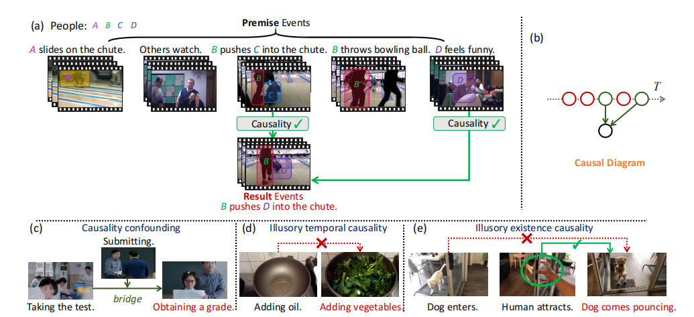
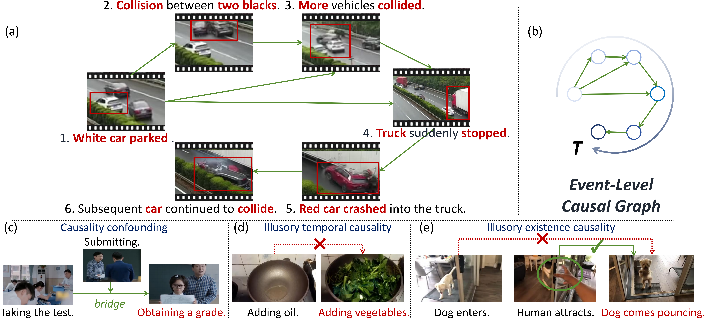
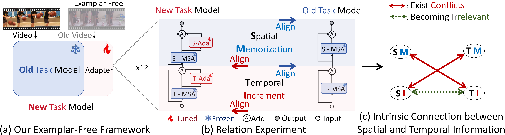

## 👋 About Me

Hello! I am **Tieyuan Chen**, a third-year Ph.D. student (2023–present) at **[Shanghai Jiao Tong University](https://en.sjtu.edu.cn/)**, **[School of Electronic Information and Electrical Engineering (SEIEE)](https://english.seiee.sjtu.edu.cn/)**, advised by Prof. **[Weiyao Lin](https://weiyaolin.github.io/)**. To date, during my Ph.D. studies, I have published **four first-author papers**, including top-tier venues such as **T-PAMI, ICLR, NeurIPS, and T-CSVT**.

Previously, I received my B.Eng. degree from **[Sichuan University](https://en.scu.edu.cn/)**, **[College of Electronics and Information Engineering (CEIE)](https://eie.scu.edu.cn/eneieen/)** (2019–2023), ranking **1 / 29**.

I was selected for the Joint PhD Program at **[Beijing Zhongguancun Academy](https://www.bjzgca.edu.cn/en/)** (Sep. 2024 – June 2028).

Currently, I am a Research Intern at **[AGI Center, Ant Research Institute](https://www.antresearch.com/)** (Mar. 2025 – Present), working under the supervision of [Jianguo Li](https://sites.google.com/site/leeplus/), [Tao Lin](https://tlin-taolin.github.io/), [Haoxing Chen](https://chenhaoxing.github.io/), and [Huabin Liu](https://r00kie-liu.github.io/).

---

## 🔬 Research Interests

My research focuses on:

- 🎥 **Video Understanding & Video Reasoning**
- 🧠 **Large Language Models (LLMs) & Multimodal LLMs (MLLMs)**
- 🔗 **Causal Reasoning and Event-level Modeling**

📫 Feel free to reach out via email:  
**[tieyuanchen@sjtu.edu.cn](mailto:tieyuanchen@sjtu.edu.cn)**

---

## 🥇 Honors and Awards

- **China National Scholarship** (2021) — *Top 1%*
- **China National Scholarship** (2022) — *Top 1%*
- **Sichuan University Comprehensive Special Scholarship** (2022) — *Top 0.1%*
- **Sichuan University Hundred Excellent Student** (2022) — *Top 0.2%*
- **Sichuan Province Outstanding Graduate** (2023) — *Top 3%*

---

## 📝 First-Author Publications

<table style="width:100%;border:0px;border-spacing:0px;border-collapse:separate;margin-right:auto;margin-left:auto;">

  <!-- Paper 1: NeurIPS 2024 -->
  <tr>
    <td style="padding:20px;width:30%;vertical-align:middle">
      
    </td>
    <td style="padding:20px;width:70%;vertical-align:middle">
      <a href="https://arxiv.org/abs/2409.17647">
        MECD: Unlocking Multi-Event Causal Discovery in Video Reasoning
      </a>
       
      <strong>Tieyuan Chen</strong>, Huabin Liu, Tianyao He, Yihang Chen, Chaofan Gan, Xiao Ma, Cheng Zhong, Yang Zhang, Yingxue Wang, Hui Lin, Weiyao Lin
       
      <em>Conference on Neural Information Processing Systems (NeurIPS), 2024</em> (Spotlight, Top 2.4%)
       
      
      
    </td>
  </tr>

  <!-- Paper 2: ICLR 2026 -->
  <tr>
    <td style="padding:20px;width:30%;vertical-align:middle">
      
    </td>
    <td style="padding:20px;width:70%;vertical-align:middle">
      <a href="https://arxiv.org/abs/2510.11001">
        DND: Boosting Large Language Models with Dynamic Nested Depth
      </a>
       
      <strong>Tieyuan Chen</strong>, Xiaodong Chen, Haoxing Chen, Zhenzhong Lan, Weiyao Lin, Jianguo Li
       
      <em>International Conference on Learning Representations (ICLR), 2026</em>
       
      
    </td>
  </tr>

  <!-- Paper 3: TPAMI -->
  <tr>
    <td style="padding:20px;width:30%;vertical-align:middle">
      
    </td>
    <td style="padding:20px;width:70%;vertical-align:middle">
      <a href="https://arxiv.org/abs/2501.07227">
        MECD+: Unlocking Event-Level Causal Graph Discovery for Video Reasoning
      </a>
       
      <strong>Tieyuan Chen</strong>, Huabin Liu, Yi Wang, Yihang Chen, Tianyao He, Chaofan Gan, Huanyu He, Weiyao Lin
       
      <em>IEEE Transactions on Pattern Analysis and Machine Intelligence (TPAMI)</em>
       
      
      
    </td>
  </tr>

  <!-- Paper 4: TCSVT -->
  <tr>
    <td style="padding:20px;width:30%;vertical-align:middle">
      
    </td>
    <td style="padding:20px;width:70%;vertical-align:middle">
      <a href="https://arxiv.org/abs/2501.07236">
        CSTA: Spatial-Temporal Causal Adaptive Learning for Exemplar-Free Video Class-Incremental Learning
      </a>
       
      <strong>Tieyuan Chen</strong>, Huabin Liu, Chern Hong Lim, John See, Xing Gao, Junhui Hou, Weiyao Lin
       
      <em>IEEE Transactions on Circuits and Systems for Video Technology (TCSVT)</em>
       
      
      
    </td>
  </tr>
</table>

---

## 📊 Academic Service

**Reviewer for Conferences**
*   **2026**: CVPR, ECCV, ICLR, ICML, ICME
*   **2025**: CVPR, ICCV, NeurIPS, ICLR, AAAI, ICME, PRCV

**Reviewer for Journals**
*   Journal of Visual Communication and Image Representation (JVCIR)
*   Signal Processing: Image Communication (SPIC)

**Journals**  
- Journal of Visual Communication and Image Representation (JVCI)  
- Signal Processing: Image Communication (SPIC)
