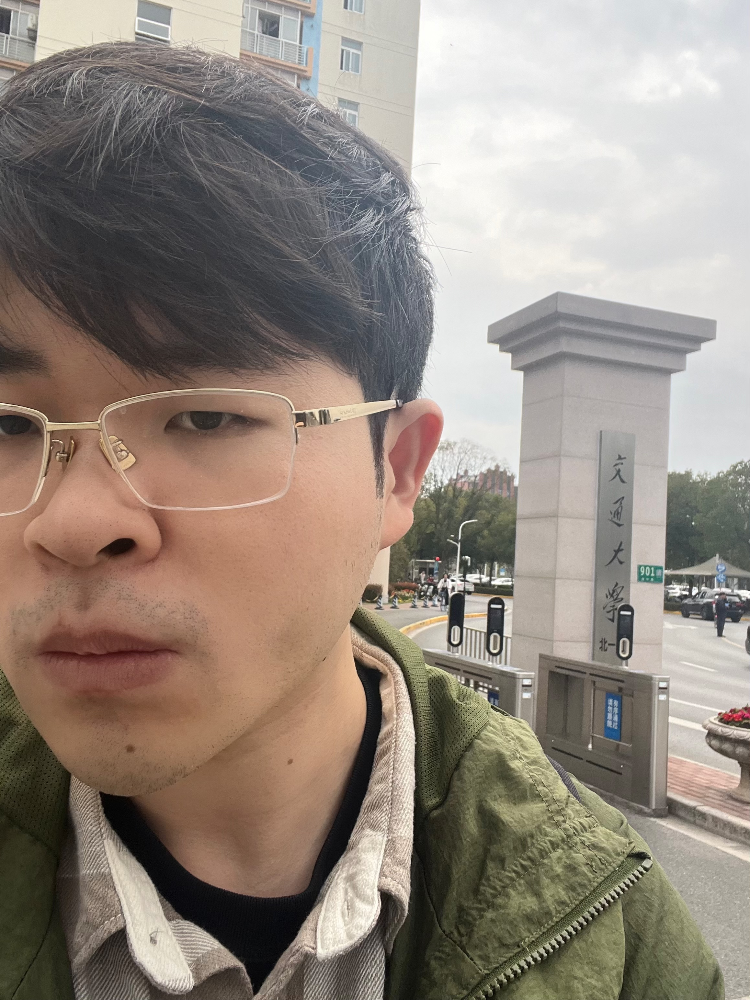

<!-- 个人简介板块：左文右图 -->

  

    <h1>👋 About Me</h1>
    

      Hello! I am <strong>Tieyuan Chen (陈铁元)</strong>, a third-year Ph.D. student (2023–present) at 
      <a href="https://en.sjtu.edu.cn/">Shanghai Jiao Tong University (SJTU)</a>, 
      <a href="https://english.seiee.sjtu.edu.cn/">School of Electronic Information and Electrical Engineering (SEIEE)</a>, 
      advised by Prof. <a href="https://weiyaolin.github.io/">Weiyao Lin</a>.
    

    

      Currently, I am a Research Intern at <strong>AGI Center, Ant Research Institute</strong> (Mar. 2025 – Present), working with 
      <a href="https://sites.google.com/site/leeplus/">Jianguo Li</a>, 
      <a href="https://tlin-taolin.github.io/">Tao Lin</a>, 
      <a href="https://chenhaoxing.github.io/">Haoxing Chen</a>, and 
      <a href="https://r00kie-liu.github.io/">Huabin Liu</a>.
    

    

      I received my B.Eng. degree from <strong>Sichuan University (SCU)</strong> (2019–2023), ranking <strong>1 / 29</strong>. I was also selected for the Joint PhD Program at <a href="https://www.bjzgca.edu.cn/en/">Beijing Zhongguancun Academy</a>.
    

    

      My research goal is to build intelligent systems capable of complex <strong>Video Reasoning</strong> and <strong>Causal Discovery</strong>. I have published <strong>four first-author papers</strong> in top-tier venues including <strong>TPAMI, NeurIPS, ICLR, and TCSVT</strong>.
    

    
    <!-- 社交链接按钮 -->
    

      
      
      
    

  

  <!-- 头像区域 (请替换 your_photo.jpg) -->
  

    
  

---

<!-- 新闻板块 -->
## 🔥 News
<ul>
  <li><strong>[Mar. 2025]</strong> Started research internship at <strong>Ant Research Institute (AGI Center)</strong>.</li>
  <li><strong>[Feb. 2026]</strong> One paper accepted by <strong>ICLR 2026</strong>.</li>
  <li><strong>[Jan. 2025]</strong> Two papers accepted by <strong>IEEE TPAMI</strong> and <strong>IEEE TCSVT</strong>.</li>
  <li><strong>[Sep. 2024]</strong> Selected for the Joint PhD Program at <strong>Beijing Zhongguancun Academy</strong>.</li>
  <li><strong>[Sep. 2024]</strong> One paper accepted by <strong>NeurIPS 2024 (Spotlight)</strong>.</li>
</ul>

---

<!-- 研究兴趣 -->
## 🔬 Research Interests

  🎥 Video Understanding & Reasoning
  🧠 LLMs & Multimodal LLMs
  🔗 Causal Discovery

---

<!-- 论文板块：使用 HTML Table 布局实现左图右文 -->
## 📝 Selected Publications

<table style="width:100%;border:0px;border-spacing:0px;border-collapse:separate;margin-right:auto;margin-left:auto;">

  <!-- Paper 1: NeurIPS 2024 -->
  <tr>
    <td style="padding:20px;width:30%;vertical-align:middle">
      
    </td>
    <td style="padding:20px;width:70%;vertical-align:middle">
      <a href="https://arxiv.org/abs/2409.17647">
        MECD: Unlocking Multi-Event Causal Discovery in Video Reasoning
      </a>
       
      <strong>Tieyuan Chen</strong>, Huabin Liu, Tianyao He, Yihang Chen, Chaofan Gan, Xiao Ma, Cheng Zhong, Yang Zhang, Yingxue Wang, Hui Lin, Weiyao Lin
       
      <em>NeurIPS 2024</em> (Spotlight, Top 2.4%)
       
      
      
    </td>
  </tr>

  <!-- Paper 2: ICLR 2026 -->
  <tr>
    <td style="padding:20px;width:30%;vertical-align:middle">
      
    </td>
    <td style="padding:20px;width:70%;vertical-align:middle">
      <a href="https://arxiv.org/abs/2510.11001">
        DND: Boosting Large Language Models with Dynamic Nested Depth
      </a>
       
      <strong>Tieyuan Chen</strong>, Xiaodong Chen, Haoxing Chen, Zhenzhong Lan, Weiyao Lin, Jianguo Li
       
      <em>International Conference on Learning Representations (ICLR), 2026</em>
       
      
    </td>
  </tr>

  <!-- Paper 3: TPAMI -->
  <tr>
    <td style="padding:20px;width:30%;vertical-align:middle">
      
    </td>
    <td style="padding:20px;width:70%;vertical-align:middle">
      <a href="https://arxiv.org/abs/2501.07227">
        MECD+: Unlocking Event-Level Causal Graph Discovery for Video Reasoning
      </a>
       
      <strong>Tieyuan Chen</strong>, Huabin Liu, Yi Wang, Yihang Chen, Tianyao He, Chaofan Gan, Huanyu He, Weiyao Lin
       
      <em>IEEE Transactions on Pattern Analysis and Machine Intelligence (TPAMI)</em>
       
      
      
    </td>
  </tr>

  <!-- Paper 4: TCSVT -->
  <tr>
    <td style="padding:20px;width:30%;vertical-align:middle">
      
    </td>
    <td style="padding:20px;width:70%;vertical-align:middle">
      <a href="https://arxiv.org/abs/2501.07236">
        CSTA: Spatial-Temporal Causal Adaptive Learning for Exemplar-Free Video Class-Incremental Learning
      </a>
       
      <strong>Tieyuan Chen</strong>, Huabin Liu, Chern Hong Lim, John See, Xing Gao, Junhui Hou, Weiyao Lin
       
      <em>IEEE Transactions on Circuits and Systems for Video Technology (TCSVT)</em>
       
      
      
    </td>
  </tr>
</table>

---

## 🥇 Honors and Awards
*   **2023**: Sichuan Province Outstanding Graduate (Top 3%)
*   **2022**: **China National Scholarship** (Top 1%)
*   **2022**: Sichuan University Comprehensive Special Scholarship (Top 0.1%)
*   **2022**: Sichuan University Hundred Excellent Student (Top 0.2%)
*   **2021**: **China National Scholarship** (Top 1%)

---

## 📊 Academic Service

**Reviewer for Conferences**
*   **2026**: CVPR, ECCV, ICLR, ICML, ICME
*   **2025**: CVPR, ICCV, NeurIPS, ICLR, AAAI, ICME, PRCV

**Reviewer for Journals**
*   Journal of Visual Communication and Image Representation (JVCIR)
*   Signal Processing: Image Communication (SPIC)

 

Last updated: Feb. 2026

